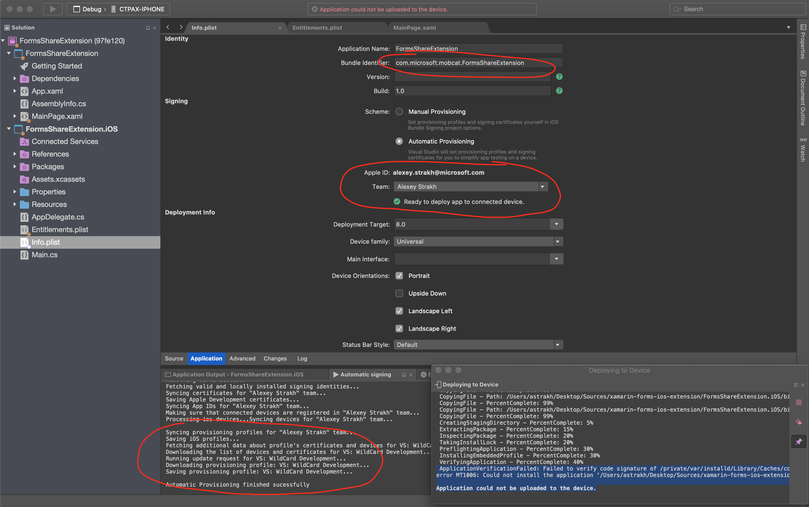
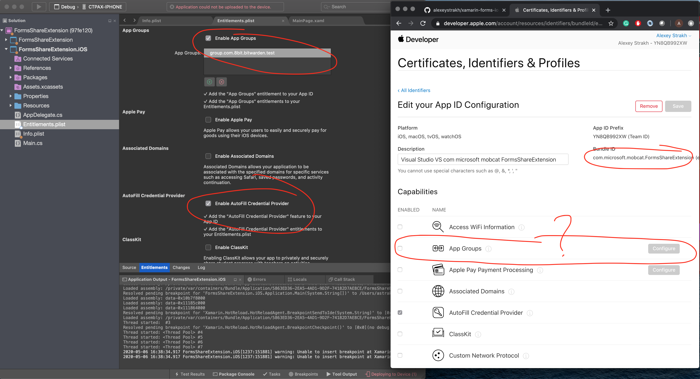

# xamarin-forms-ios-extension

## automatic provisioning issue

Steps:

1. Create new empty Xamarin.Forms app with iOS app enabled
1. Open Entitlements.plist and check `Enable App Groups`, add any random group name like `group.com.my.test`
1. Open  Info.plist and switch the scheme to be `Automatic Provisioning`. Select your dev team and wait until compeleted

[Bug #1] Result: a new app id is not generated because the wildcard profile is used, the auto-provision feature ignores the app groups entitlement as required for non-wildcard app id. In this case automatic provisioning choses the wildcard app id and profile.

1. Open Entitlements.plist and check `Enable AutoFill Credential provider`, this entitlement is recognized and new AppId is created. In this case automatic provisioning choses the app specific app id and a related profile.

[Bug #2] Result: a new app id is generated but it doesn't include the App Groups capability

In both cases, the VS4Mac is unable to deploy the app to device with the following error:

```bash
ApplicationVerificationFailed: Failed to verify code signature of /private/var/installd/Library/Caches/com.apple.mobile.installd.staging/temp.DJgPAL/extracted/FormsShareExtension.iOS.app : 0xe8008016 (The executable was signed with invalid entitlements.)
error MT1006: Could not install the application '/Users/<user>/Sources/xamarin-forms-ios-extension/FormsShareExtension.iOS/bin/iPhone/Debug/device-builds/iphone10.3-13.4.1/FormsShareExtension.iOS.app' on the device '<device-name>': Your code signing/provisioning profiles are not correctly configured. Probably you have an entitlement not supported by your current provisioning profile, or your device is not part of the current provisioning profile. Please check the iOS Device Log for details (error: 0xe8008016).

Application could not be uploaded to the device.
```




